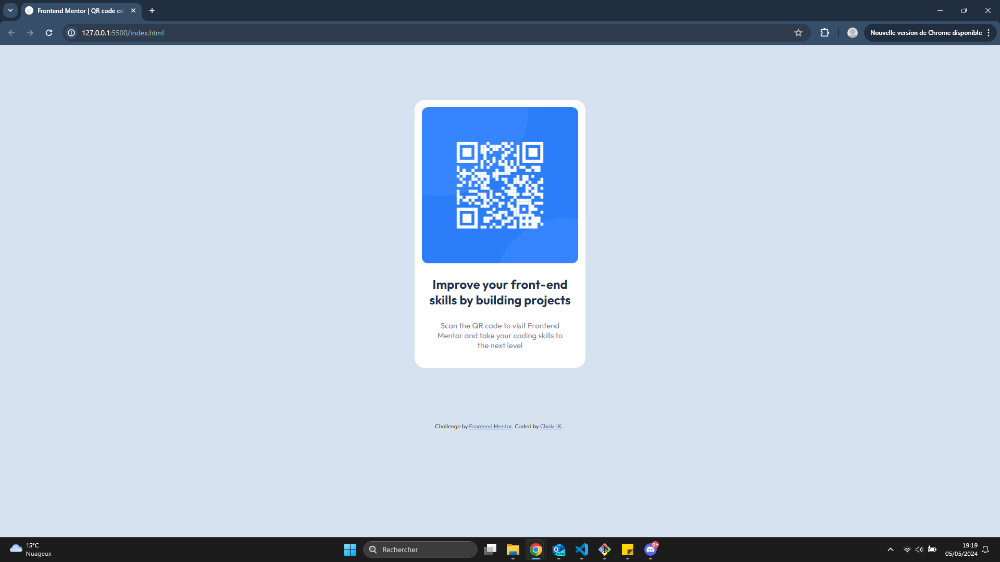

# Frontend Mentor - QR code component solution

This is a solution to the [QR code component challenge on Frontend Mentor](https://www.frontendmentor.io/challenges/qr-code-component-iux_sIO_H). Frontend Mentor challenges help you improve your coding skills by building realistic projects.

**Tanks for your help, Chokri K.**

## Table of contents

- [Overview](#overview)
  - [Screenshot](#screenshot)
  - [Links](#links)
- [My process](#my-process)
  - [Built with](#built-with)
  - [What I learned](#what-i-learned)
  - [Continued development](#continued-development)
- [Author](#author)

## Overview

### Screenshot



### Links

- Solution URL: [Frontend Mentor | QR code component | Chokri K.](https://chokrikadoussi.github.io/qrcode-compo/)

## My process

### Built with

- Semantic HTML
- HTML classes and span
- Use of em/rem size
- CSS variables for colors
- Flexbox
- API for font-family Outfit

### What I learned

```html
<link
  href="https://fonts.googleapis.com/css2?family=Outfit:wght@100..900&display=swap"
  rel="stylesheet"
/>
```

```css
:root {
  --White: hsl(0, 0%, 100%);
}
```

### Continued development

- Center the footer
- Website responsive : with media query for mobile device

## Author

- Github - [@chokrikadoussi](https://github.com/chokrikadoussi)
- Frontend Mentor - [@chokrikadoussi](https://www.frontendmentor.io/profile/chokrikadoussi)
